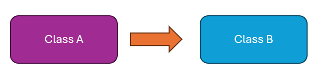
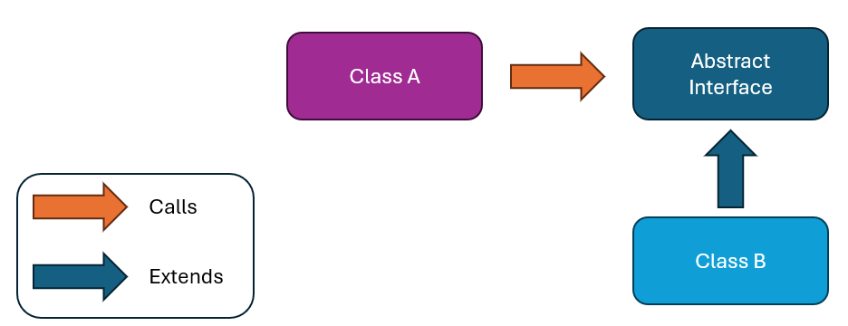
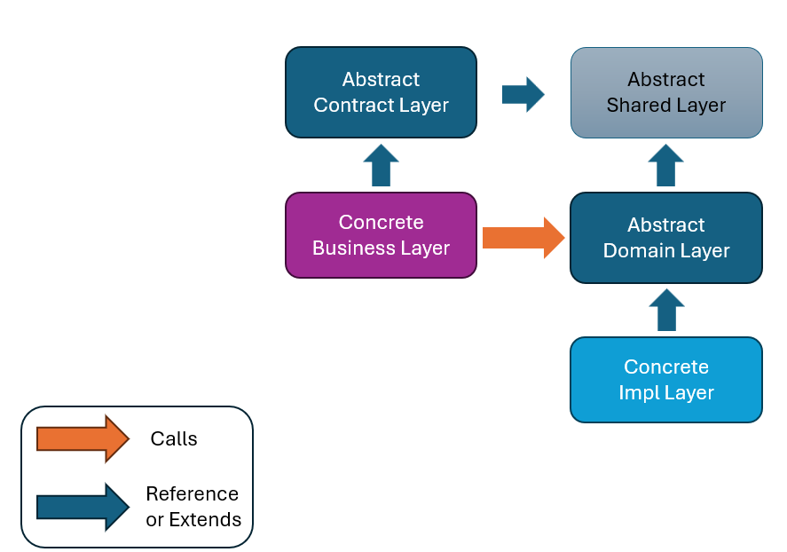

### Overview

Abstract Driven Development (A.D.D) is a methodology that emphasizes the use of abstractions and layering to create scalable, maintainable, and flexible software systems. A.D.D aims to achieve the following goals:

- **Simplicity / KISS (Keep It Simple, Stupid)**: Ensure the methodology is easy to apply and understand, maintaining a short learning curve by avoiding an overload of new concepts.
- **Scalability**: Make it suitable for projects of all sizes, from microservices to large-scale applications.
- **Clarity**: Provide a clear classification of components into respective layers.

By maintaining these properties, systems using A.D.D can ensure extensibility, easy maintenance, and seamless replacement of system components.

Below is a detailed breakdown of its core concepts and principles.

### Key Concepts

#### Dependency Inversion

- **Base Principle**: High-level modules should not depend on low-level modules. Both should depend on abstractions.
- **Application in A.D.D**: Apply dependency inversion across different layers of the application.

#### Abstraction Levels

- **Abstract**: Interfaces and abstract components.
- **Concrete**: Implementations of the abstract components.

#### Components

- **Data Components**: Data Transfer Objects (DTOs), entities.
- **Action Components**: Services that perform actions on the data.

#### Coupling of the Components

- **Tightly Coupled**: Components that are difficult to replace (e.g., `EntityFramework.Core`).
- **Loosely Coupled**: Components that are easy to switch (e.g., `EntityFramework.Postgres`, `EntityFramework.Sqlite`).

### Layers

1. **Abstract Contract Layer**: Abstraction for interacting with the outside.
   1. Defines external contracts and interfaces for the system.
   1. Independent of any specific technology or framework.
   1. Includes Data Transfer Objects (DTOs) to transport data between the outside and the Business Application, feature interfaces, and outer events (a kind of DTO).
1. **Abstract Domain Layer**: Abstraction for inner interaction.
   1. Independent of any specific technology or framework.
   1. Defines entities, interfaces, abstract classes, and inner events.
   1. **Entities**: Only have fields and validation rules on the fields. An entity is a type of DTO used internally.
   1. Listens to and processes outer events.
   1. **Inner events**: Also called domain events, used internally between the Business Application & Concrete Infrastructure. Can fire and listen to inner events, which may also originate from the Infrastructure layer.
1. **Concrete Business Layer**
   1. Contains core business logic. Implements application features (only what is described from the contract layer). Does not implement functions from the service interfaces in the Domain.
   1. Handles outer events.
   1. Handles conversion between DTOs and Entities (e.g., AutoMapper profiles can be placed in this layer).
   1. Implements outputs such as Minimal APIs or controllers.
1. **Concrete Implementation Layer**
   1. Provides concrete implementations of services, repositories, inner event publishers, and integrations.
   1. Integrates with databases, message queues, and other infrastructure components.
   1. This layer might have multiple versions (e.g., version for Postgres, version for Mongo, etc.). Initially, the system might run with a mock infrastructure layer, which does nothing and only returns default values.
1. **Program Layer**
   1. This is the layer for the executable file.
   1. References the Business Application Layer & Concrete Infrastructure Layer.
   1. Defines dependency injection.
   1. Handles other tasks for initializing the application (what is not related to the business).

### Layer Interactions / DTO Types

- **No Cross-Layer References**: Each (concrete) layer should only interact (i.e., directly call functions) with the (abstract) layers directly above or below it.
  - **Business Layer** can only see Contract and Domain Layers.
  - **Infrastructure Layer** can only see Domain Layer.
- **No direct communication between concrete layers**: The concrete layers only send out events for other concrete layers to listen to.
- In summarization, there are
  - DTOs
  - Entities
  - Events
  - Outer Events

### Placing Components in Layers

The A.D.D principle ensures that at any given time, a component can be easily identified for its layer based on the following template:

- **Abstract Contract Layer**
  - DTOs
  - Outer Events
  - External service interfaces (the services in Business Layer)
- **Abstract Domain Layer**
  - Entities
  - Events
  - Internal Service Interfaces (the services in Infrastructure Layer)
- **Concrete Business Layer**
  - Services implementation
  - Event listeners (they are services too)
- **Concrete Implementation Layer**
  - Services implementation
  - Event listeners

For components that are not clearly identified for a specific layer, answer the following questions:

- Is it abstract? If yes, it goes to Contract/Domain Layer.
- Is it concrete? If yes, it goes to Business/Infrastructure Layer.
- Will there be multiple kinds of this component in the future?
  - If yes, it goes to the Infrastructure Layer.
  - If no, it goes to the Business Layer.

### Implementation Strategies

#### For Big Projects (From BRD)

1. **Define Contract Layer**
   1. DTOs: Based on real-world inputs (e.g., papers, identity cards).
   1. External Services: Defined by the system's main functions.
1. **Define Domain Layer**
   1. Entities and internal services for the big services.
   1. Events that will be used within the system.

#### For Small Projects (From Scratch)

1. **Initial Program**: Write a basic program that can run.
1. **Refactoring**: Break the code into DTOs, interfaces, and services, then move them into appropriate layers.

#### For Existing Code

1. **Reorganization**: Classify and move components into layers by asking:
   1. Is it abstract? If yes, it goes to Contract/Domain Layer.
   1. Is it concrete? If yes, it goes to Business/Infrastructure Layer.
   1. Will there be multiple kinds of this component in the future?
      1. If yes, it goes to the Infrastructure Layer.
      1. If no, it goes to the Business Layer.

### Suggested Writing Order

#### For Big Projects

1. **Contract Descriptors Layer**
1. **Abstract Domain Layer**
1. **Business Application Layer**
1. **Concrete Infrastructure Layer**

#### For Small Projects

1. **Runnable Program**: Start with a monolith.
1. **Generate Unit Test**: Ensure functionality.
1. **Generate the Layers**: Refactor into layers.

### Conclusion

Abstract Driven Development provides a structured approach to software design and development, ensuring that systems are scalable, maintainable, and flexible. By following the layering and abstraction principles, developers can create robust systems that are easy to understand and evolve over time.

### Contact

vu.minh.quang@outlook.com
